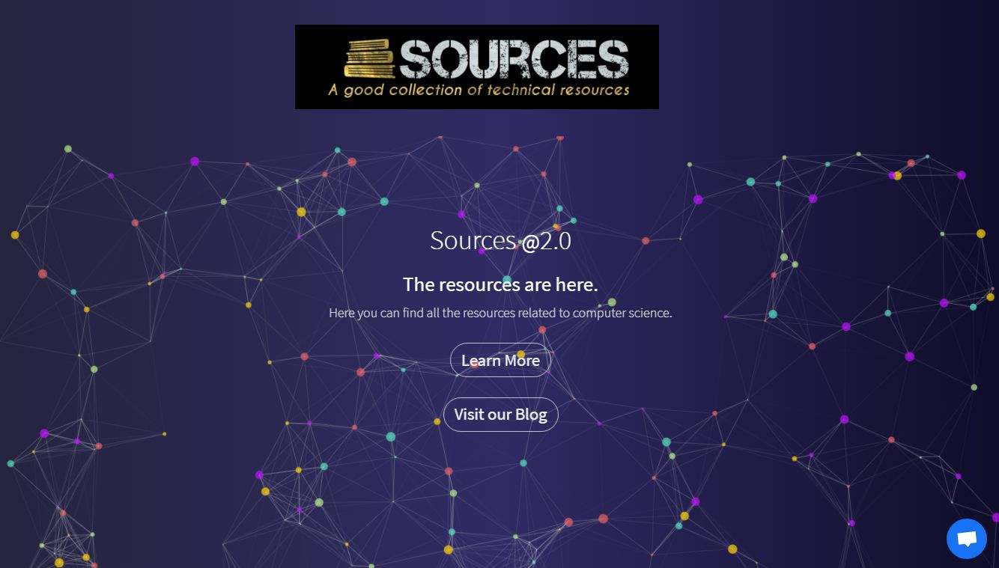
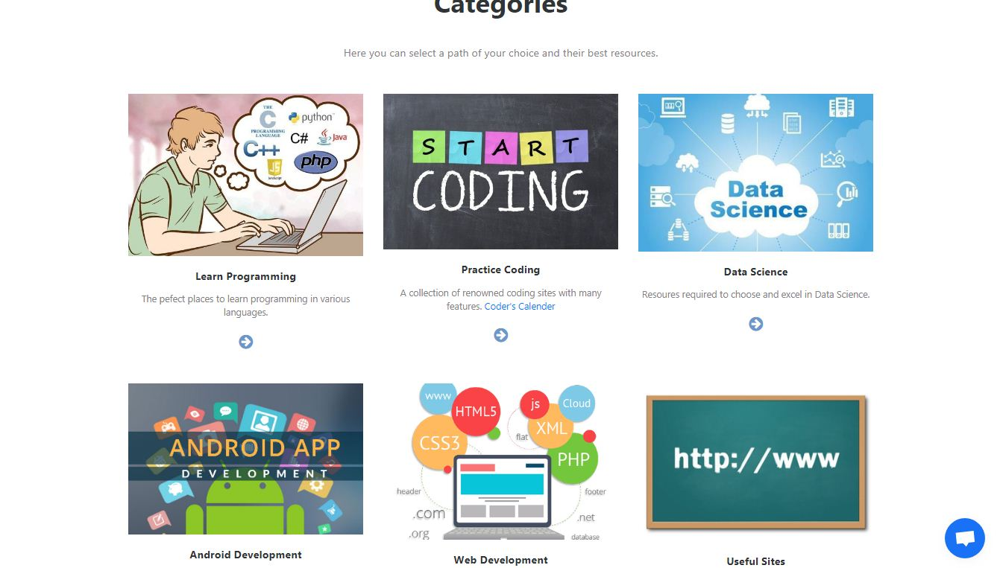
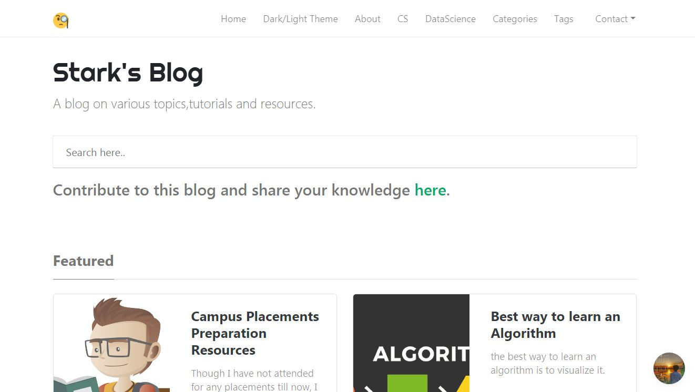
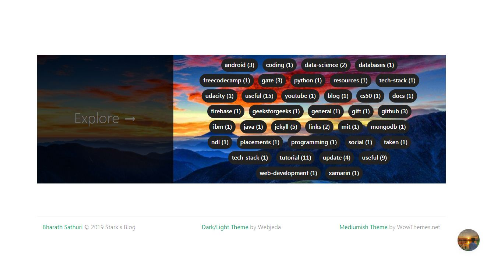

# StarkSources.

> [visit this website](https://starksources.github.io/)

I have built this website with the help of basic template from boostrap studio. 
I have collected all the useful resources for a computer science student and divided into sub-categories and developed this website.
I have shared this to all my friends and on various platforms  and everyone gave a positive feedback on the use of this website.
It has visits from more than 20 countries and now i wanted to this website to have 
## more collections of various streams
so that this one website will be helpful to all the students with various latest updates,news etc.I wanted this website to be an 
## open source
project so that it can be easily built with the help of many developers.

You 
#### too
can contribute to this website.

you can also check out our blog which is an extension to this site at [link](https://starksources.github.io/myblog/)

Bharath Sathuri
[mail me](sathuribharathbrothers1234@gmail.com)

you can know more about me here..!
[about me](https://about.me/bharathsathuri)

